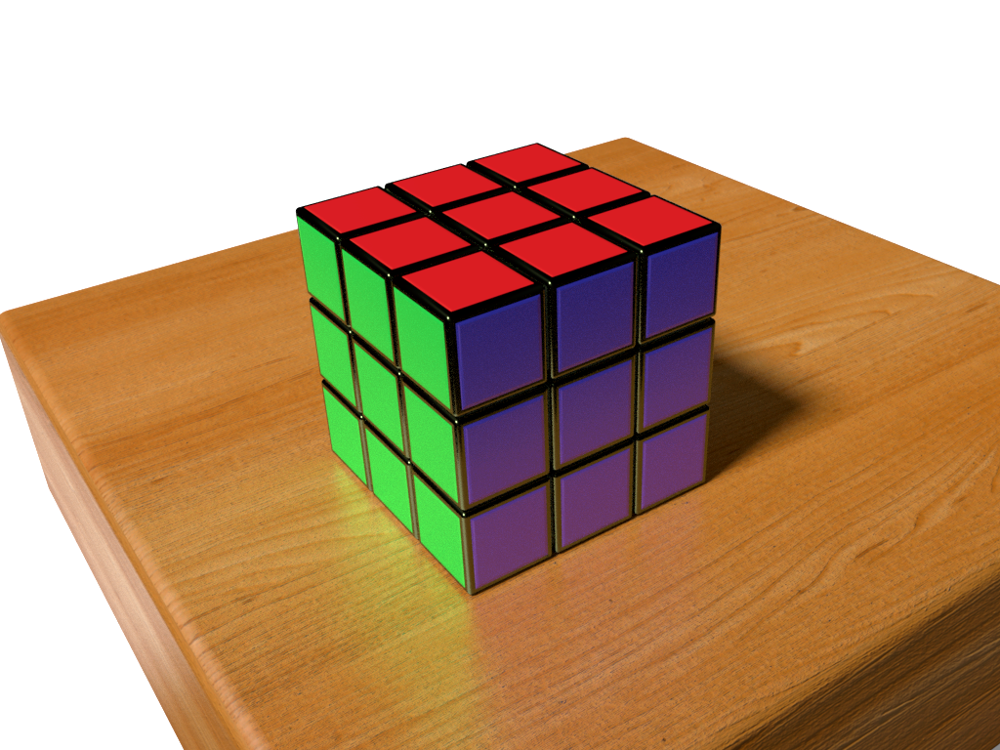
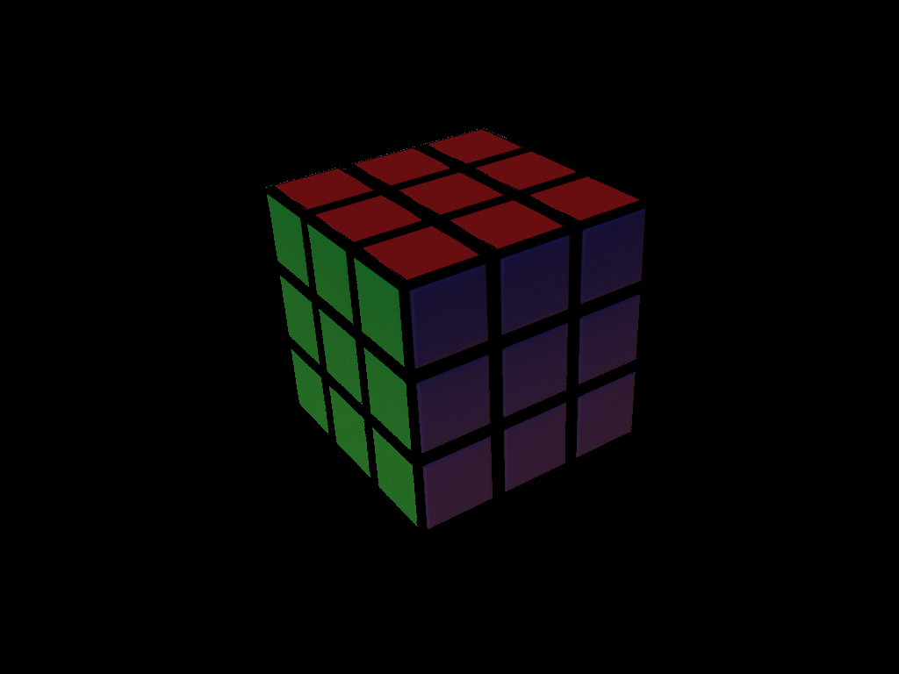
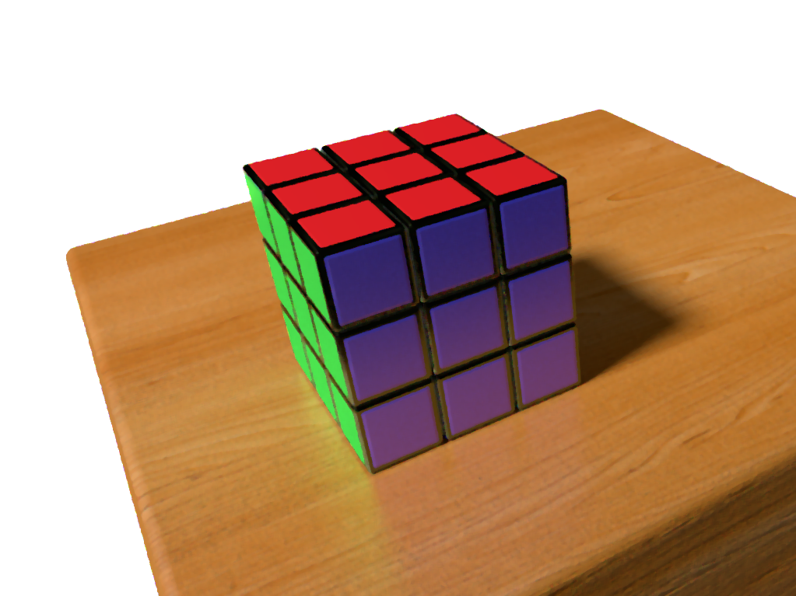
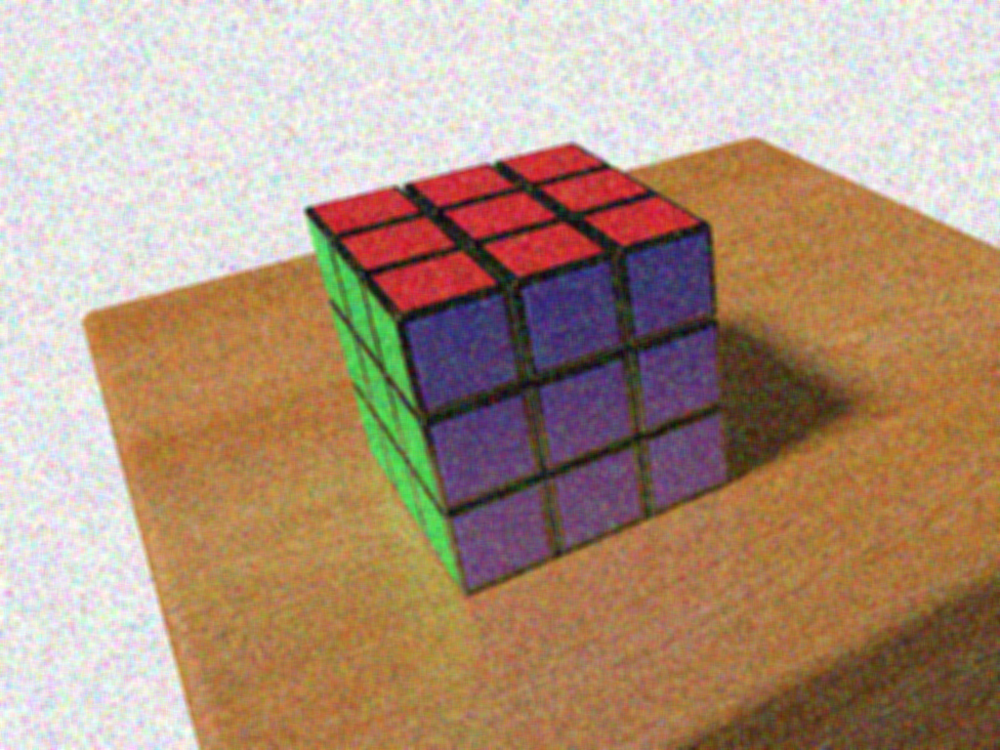

# Projet_CV

Learning OpenCV with C

# Some screenshots

|                 |               |
| ---------------------------------------- | ---------------------------------- |
|  |          |
|                |    |
|    |     |
|             |  |
|           |       |

# Contributors 

- [Vincent COMMIN](https://github.com/Altimors/)
- [Louis LEENART](https://github.com/TheBoje/)