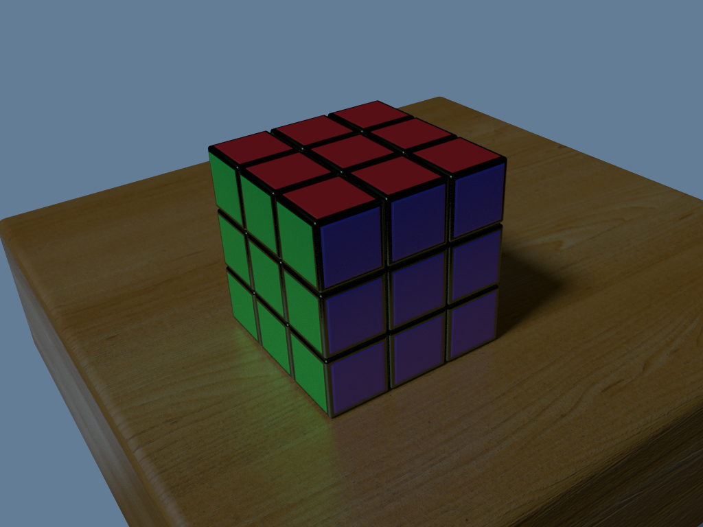
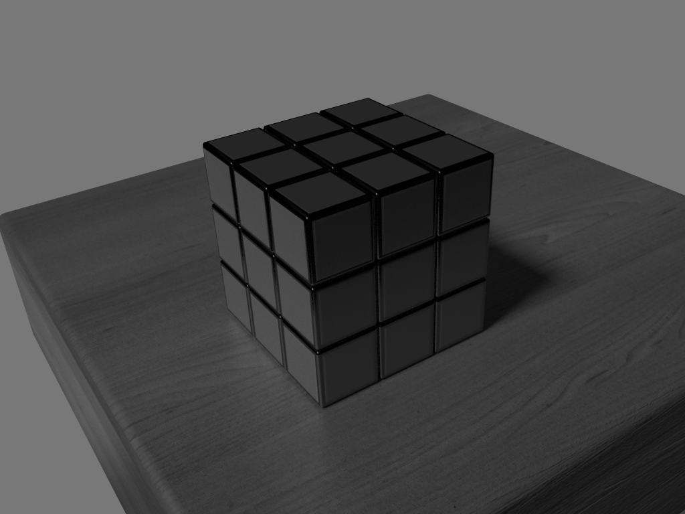
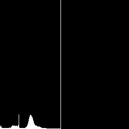
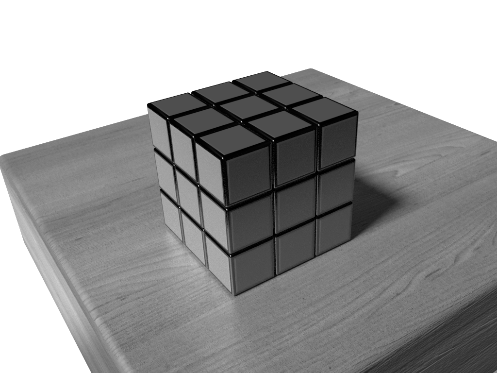
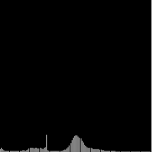

# Compte rendu de TP 1

Composition du groupe : 
- Vincent COMMIN
- Louis LEENART

- [Compte rendu de TP 1](#compte-rendu-de-tp-1)
- [Introduction](#introduction)
- [Exercice 2 : Histogramme 1D sur niveaux de gris](#exercice-2--histogramme-1d-sur-niveaux-de-gris)
  - [1. Calcul de l'histogramme de l'image](#1-calcul-de-lhistogramme-de-limage)
  - [2. Étirement d'histogramme](#2-étirement-dhistogramme)
  - [3. Création du masque](#3-création-du-masque)
  - [4. Histogramme avec masque](#4-histogramme-avec-masque)
  - [5. Histogramme cumulé et égalisation d'histogramme](#5-histogramme-cumulé-et-égalisation-dhistogramme)
- [Exercice 3 : Balance des blancs sur les canaux BGR](#exercice-3--balance-des-blancs-sur-les-canaux-bgr)
  - [1. Création d'une fonction de balance des blancs](#1-création-dune-fonction-de-balance-des-blancs)
  - [2. Utilisation de la fonction de OpenCV](#2-utilisation-de-la-fonction-de-opencv)
  - [3. Balance des blancs seuillée](#3-balance-des-blancs-seuillée)
- [Exercice 4 : Histogramme 1D sur les canaux BGR](#exercice-4--histogramme-1d-sur-les-canaux-bgr)
  - [1. Superposition des histogrammes](#1-superposition-des-histogrammes)
  - [2. Prise en compte du masque](#2-prise-en-compte-du-masque)
  - [3. Comparaison des histogramme](#3-comparaison-des-histogramme)
  - [4. Étirement d'histogramme](#4-étirement-dhistogramme)
  - [5. Égalisation d'histogramme](#5-égalisation-dhistogramme)
  - [6. Seuillage de l'image](#6-seuillage-de-limage)
- [Exercice 5 : Histogramme 1D sur les canaux HLS](#exercice-5--histogramme-1d-sur-les-canaux-hls)
  - [1. Conversion vers HLS](#1-conversion-vers-hls)
  - [2. Histogramme HLS](#2-histogramme-hls)
  - [3. Egalisation d'histogramme HLS](#3-egalisation-dhistogramme-hls)
  - [4. Segmentation de l'image](#4-segmentation-de-limage)

# Introduction

Ce premier TP de Computer Vision a pour but de nous initier à la libraire OpenCV, notamment avec la manipulation d'histogrammes (création, étirement, égalisation), de format d'encodage d'image (BGR, nuances de gris, HLS, etc.) et avec la notion de masque.

L'exercice 1 traitant la prise en main d'OpenCV, nous n'avons pas jugés nécessaire de l'inclure dans ce document.

# Exercice 2 : Histogramme 1D sur niveaux de gris

## 1. Calcul de l'histogramme de l'image

Une fois convertie en niveaux de gris (`COLOR_BGR2GRAY`), nous calculons l'histogramme tel que $H(k)=n_k$, $k$ le $k^e$ niveau de gris et $n_k$ le nombre de pixels possédant le ton $k$ dans l'image. Mis sous la forme d'un diagramme en baton, on obtient alors : 

|  |  |  |
| :-----------------------: | :-------------------: | :-------------------: |
|     *Image initiale*      |   *Nuance de gris*    |     *Histogramme*     |

On constate que l'histogramme a pour maximum 120, aussi bien pour le maximum d'occurrence d'une nuance de gris, que pour la nuance de gris la plus claire (proche de 255). Ce pic correspond d'ailleurs à l'arrière plan de l'image.

## 2. Étirement d'histogramme

L'étirement d'histogramme consiste à augmenter le contraste de l'image en augmentant sur l'histogramme l'intervalle [min, max]. On obtient alors le résultat suivant :

|          Initiale          |             Etirée             |
| :------------------------: | :----------------------------: |
|  |      |
|      |  |

TODO: Répondre à la question : Êtes-vous satisfait du résultat visuel ? Est-il facile à interpréter ? Qu'est-ce qui pose problème ?

## 3. Création du masque

## 4. Histogramme avec masque

## 5. Histogramme cumulé et égalisation d'histogramme

# Exercice 3 : Balance des blancs sur les canaux BGR

## 1. Création d'une fonction de balance des blancs

## 2. Utilisation de la fonction de OpenCV

## 3. Balance des blancs seuillée

# Exercice 4 : Histogramme 1D sur les canaux BGR

## 1. Superposition des histogrammes

## 2. Prise en compte du masque

## 3. Comparaison des histogramme

## 4. Étirement d'histogramme

## 5. Égalisation d'histogramme

## 6. Seuillage de l'image

# Exercice 5 : Histogramme 1D sur les canaux HLS

## 1. Conversion vers HLS

## 2. Histogramme HLS

## 3. Egalisation d'histogramme HLS

## 4. Segmentation de l'image

|  |  |  |
| :---: | :---: | :---: |
|       |       |       |