# Compte rendu de TP 1

Composition du groupe : 
- Vincent COMMIN
- Louis LEENART

- [Compte rendu de TP 1](#compte-rendu-de-tp-1)
- [Introduction](#introduction)
- [Exercice 2 : Histogramme 1D sur niveaux de gris](#exercice-2--histogramme-1d-sur-niveaux-de-gris)
  - [1. Calcul de l'histogramme de l'image](#1-calcul-de-lhistogramme-de-limage)
  - [2. Étirement d'histogramme](#2-étirement-dhistogramme)
  - [3. Création du masque](#3-création-du-masque)
  - [4. Histogramme avec masque](#4-histogramme-avec-masque)
  - [5. Histogramme cumulé et égalisation d'histogramme](#5-histogramme-cumulé-et-égalisation-dhistogramme)
- [Exercice 3 : Balance des blancs sur les canaux BGR](#exercice-3--balance-des-blancs-sur-les-canaux-bgr)
  - [1. Création d'une fonction de balance des blancs](#1-création-dune-fonction-de-balance-des-blancs)
  - [2. Utilisation de la fonction de OpenCV](#2-utilisation-de-la-fonction-de-opencv)
  - [3. Balance des blancs seuillée](#3-balance-des-blancs-seuillée)
- [Exercice 4 : Histogramme 1D sur les canaux BGR](#exercice-4--histogramme-1d-sur-les-canaux-bgr)
  - [1. Superposition des histogrammes](#1-superposition-des-histogrammes)
  - [3. Comparaison des histogramme](#3-comparaison-des-histogramme)
  - [4. Étirement et égalisation d'histogramme](#4-étirement-et-égalisation-dhistogramme)
  - [5. Seuillage de l'image](#5-seuillage-de-limage)
- [Exercice 5 : Histogramme 1D sur les canaux HLS](#exercice-5--histogramme-1d-sur-les-canaux-hls)
  - [1. Conversion vers HLS, Histogrammes et égalisation d'histogrammes](#1-conversion-vers-hls-histogrammes-et-égalisation-dhistogrammes)
  - [2. Segmentation de l'image](#2-segmentation-de-limage)

# Introduction

Ce premier TP de Computer Vision a pour but de nous initier à la libraire OpenCV, notamment avec la manipulation d'histogrammes (création, étirement, égalisation), de format d'encodage d'image (BGR, nuances de gris, HLS, etc.) et avec la notion de masque.

L'exercice 1 traitant la prise en main d'OpenCV, nous n'avons pas jugés nécessaire de l'inclure dans ce document.

# Exercice 2 : Histogramme 1D sur niveaux de gris

## 1. Calcul de l'histogramme de l'image

Une fois convertie en niveaux de gris (`COLOR_BGR2GRAY`), nous calculons l'histogramme tel que $H(k)=n_k$, $k$ le $k^e$ niveau de gris et $n_k$ le nombre de pixels possédant le ton $k$ dans l'image. Mis sous la forme d'un diagramme en baton, on obtient alors : 

|  |  |  |
| :-----------------------: | :-------------------: | :-------------------: |
|     *Image initiale*      |   *Nuance de gris*    |     *Histogramme*     |

On constate que l'histogramme a pour maximum 120, aussi bien pour le maximum d'occurrence d'une nuance de gris, que pour la nuance de gris la plus claire (proche de 255). Ce pic correspond d'ailleurs à l'arrière plan de l'image.

## 2. Étirement d'histogramme

L'étirement d'histogramme consiste à augmenter le contraste de l'image en augmentant sur l'histogramme l'intervalle [min, max]. On obtient alors le résultat suivant :

|        Initiale        |             Etirée             |
| :--------------------: | :----------------------------: |
|  |      |
|  |  |

On remarque que l'étirement de l'histogramme amplifie le contraste de l'image. Le résultat est donc plus lisible. Cependant, l'étirement pose un problème, des couleurs déjà existantes ne sont plus présentes (écart entre plusieurs piques de couleurs).

## 3. Création du masque

On remarque que lors du calcul de l'histogramme, nous avons un pique (en 120 pour l'image en niveau de gris de base et en 255 pour l'image avec l'histogramme étirée). En scannant la couleur du fond de l'image, on se rend compte que c'est celle-ci qui influence ce pique. On peut donc l'ajouter dans le masque afin de ne pas le prendre en compte lors des calculs.

Pour le calculer, nous utilisons une croissance de germes dans les quatre coins de l'image.

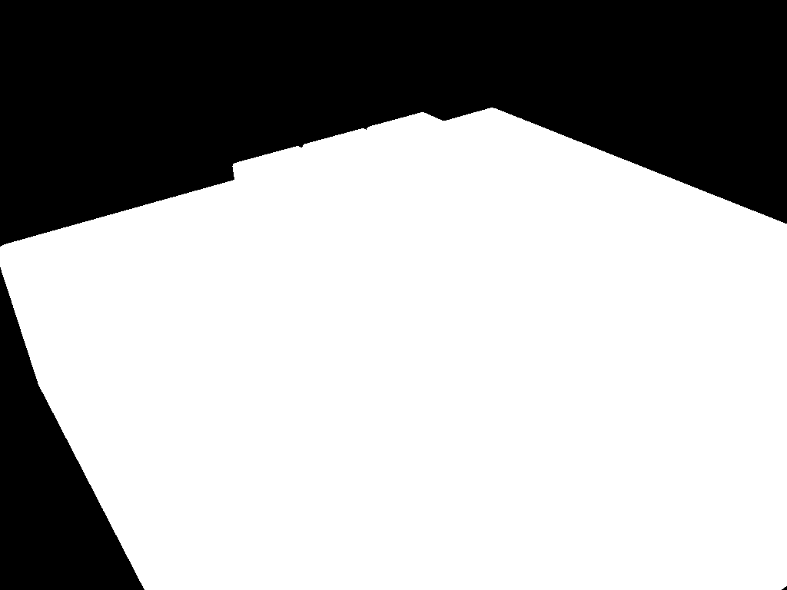

## 4. Histogramme avec masque

<table>
  <tr>
    <td>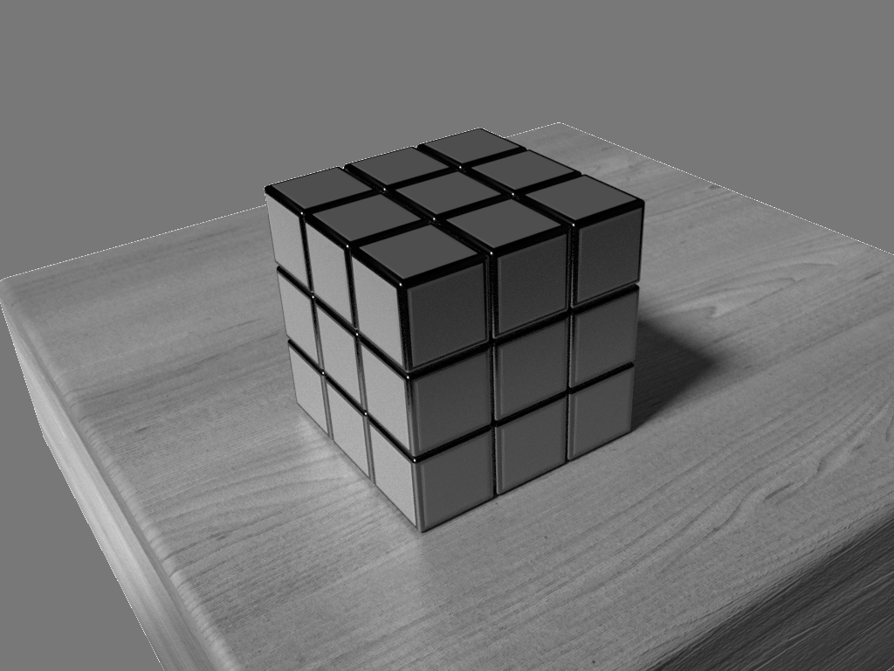</td>
    <td>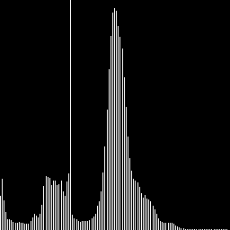</td>
  </tr>
  <tr>
    <td colspan=2><em>Image étiré avec son histogramme</td>
  </tr>
</table>

## 5. Histogramme cumulé et égalisation d'histogramme

| 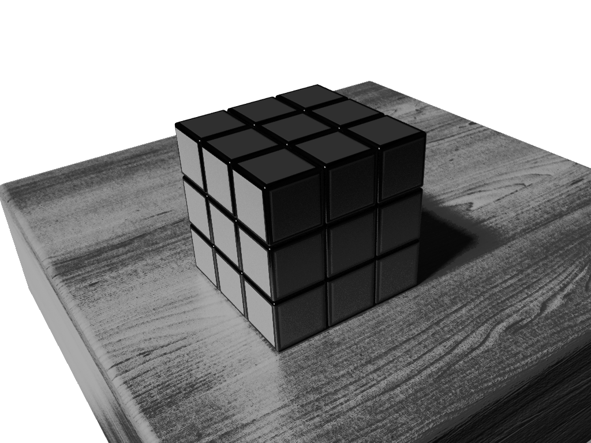 |  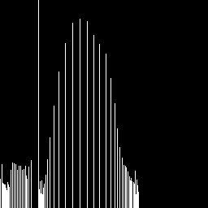  | 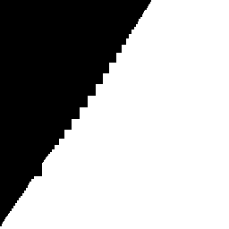 |
| :------------------------: | :-------------------------------: | :-----------------------: |
|      *image égalisée*      | *histogramme de l'image égalisée* |   *histogramme cumulé*    |

L'image issue de l'égalisation est plus contrastée que l'image originale. Son histogramme est plus étiré sur les pixels les plus clairs. On remarque que l'histogramme cumulé est bien linéaire comme attendu, cependant, il n'est pas de la forme $x = y$.

Voici les résultats de l'égalisation que nous avons programmé. Celle-ci prend en compte le masque pour le fond :
| 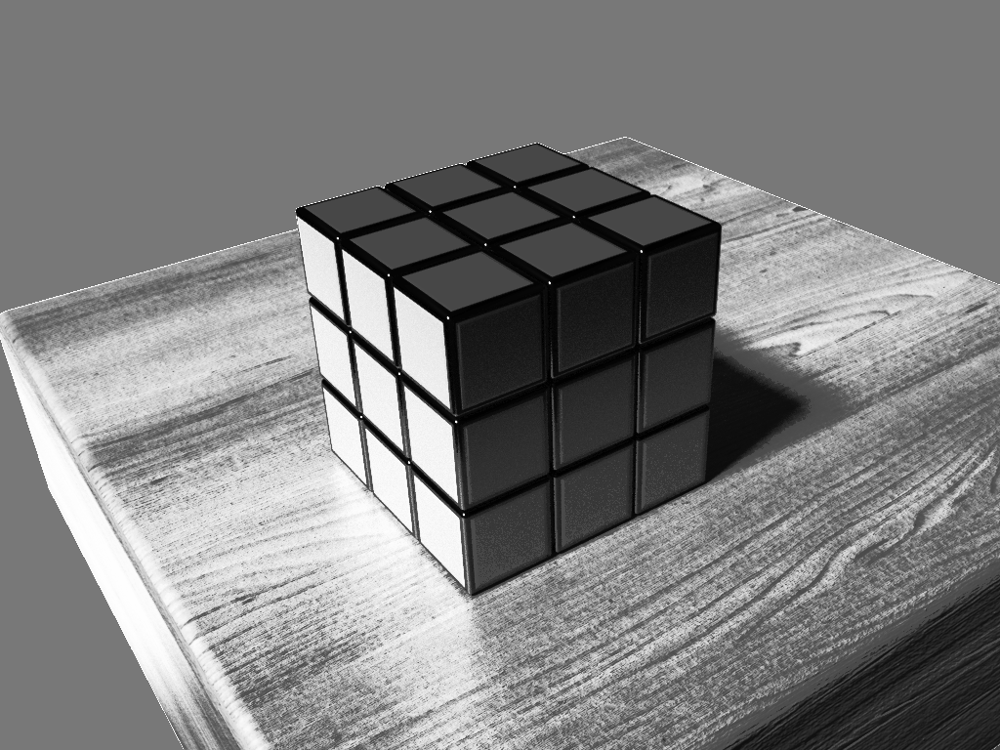 | 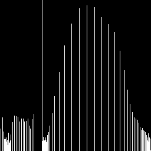 | 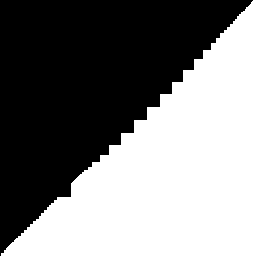 |
| :------------------------------: | :-----------------------------------: | :---------------------------------------: |
|         *image égalisée*         |   *histogramme de l'image égalisée*   |           *histogramme cumulé*            |

# Exercice 3 : Balance des blancs sur les canaux BGR

## 1. Création d'une fonction de balance des blancs

Pour appliquer une balance des blancs sur une image BGR, nous utilisons une transformation linéaire des trois canaux à partir d'une zone grise donnée en paramètre. Par exemple, à partir de l'image couleur et en utilisant un carré de 200x200 px en haut à gauche de l'image pour la référence de zone grise, nous obtenons le résultat suivant :

|  | 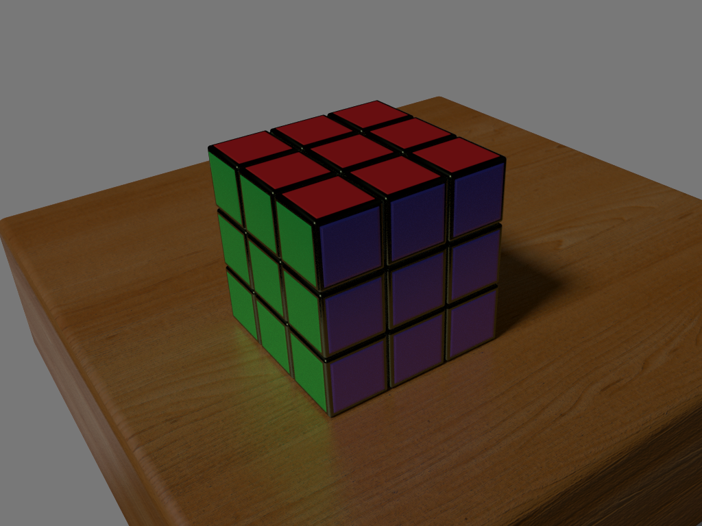 |
| :-----------------------: | :----------------------------: |
|     *image initiale*      | *image avec balance de blancs* |

Nous pouvons constater que toutes les couleurs de l'image ont été orientées vers le rouge. La face rouge du rubik's cube est plus contrastée, mais les autres couleurs semblent un peu fausses, notamment pour la couleur de la table. Ce problème est due au fait que la zone de référence donnée (donc ici l'arrière plan) n'est pas de couleur grise, faussant le calcule de transformation linéaire.

## 2. Utilisation de la fonction de OpenCV

Nous n'avons pas réussi à faire fonctionner la fonction `cv::xphoto::WhiteBalancer::balanceWhite(src, dst)`.

## 3. Balance des blancs seuillée

|  |  |  |
| :-----------------------: | :----------------------------: | :--------------------------------------: |
|     *image initiale*      | *image avec balance de blancs* | *image avec balance des blancs seuillé*  |

Avec un seuil à [35, 230], il est difficile de remarquer des différences majeures par rapport à la version non-seuillée.  

# Exercice 4 : Histogramme 1D sur les canaux BGR

## 1. Superposition des histogrammes

|  | 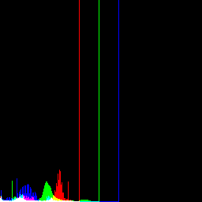 | 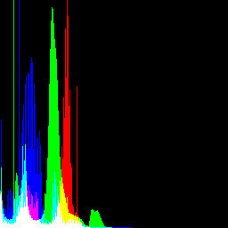 |
| :-----------------------: | :----------------------: | :---------------------------: |
|     *image initiale*      |     *histogramme 3D*     | *histogramme 3D avec masque*  |

Les pics larges correspondent à la table, et les pics très étroits correspondent aux faces du Rubik's cube ainsi qu'à l'arrière plan de l'image.

## 3. Comparaison des histogramme

|            |              |
| :--------------------------------------: | :--------------------------------------: |
| *histogramme avec masque image initiale* | *histogramme avec masque image balancée* |

On remarque que les histogrammes sont assez similaires, mais il y a un léger décalage du rouge vers la droite et du bleu vers la gauche. 

## 4. Étirement et égalisation d'histogramme

|                                                               |                    *image*                     |          *histogramme avec masque*          |
| :-----------------------------------------------------------: | :--------------------------------------------: | :-----------------------------------------: |
|                       *image initiale*                        |                      |               |
|        *balance de blancs et étirement d'histogramme*         |       |       |
|       *balance de blancs et égalisation d'histogramme*        |            |            |
| *balance de blancs et égalisation et étirement d'histogramme* |  |  |

## 5. Seuillage de l'image

En utilisant l'image résultant de l'égalisation puis étirement d'histogramme, nous avons réussi à isoler les faces, notamment avec les valeurs BRG (58, 98, 85) :

|  |
| :----------------------------------------: |
|              *image seuillée*              |

# Exercice 5 : Histogramme 1D sur les canaux HLS

## 1. Conversion vers HLS, Histogrammes et égalisation d'histogrammes

|       |       |       |                  |
| :--------------------------------: | :--------------------------------: | :--------------------------------: | :-----------------------------------------: |
|     *image balancée canal Hue*     |  *image balancée canal Lightness*  | *image balancée canal Saturation*  |      *image balancée convertie en HLS*      |
|  |  |  |                |
|      *histogramme canal Hue*       |   *histogramme canal Lightness*    |   *histogramme canal Saturation*   | *histogramme des canaux HLS affiché en BGR* |

On note que pour la conversion de `BGR` vers `HLS`, on utilise le code de conversion `cv::COLOR_BGR2HLS_FULL` qui permet d'obtenir $H \in [0, 255]$ au lieu de $[0, 180]$ avec le code `cv::COLOR_BGR2HLS`. Cela nous permet donc de réutiliser notre fonction de calcul d'histogramme 1D vu précédemment.

On remarque qu'après conversion, les couleurs de l'image HLS affichée sont incorrectes. En effet, la fonction `cv::imshow()` affiche l'image en tant que `BGR`. Pour afficher correctement l'image, il faut soit afficher les canaux séparément, soit convertir l'image `HLS` en `BGR` et donc utiliser `cv::imshow()` convenablement. 

On remarque que la table a une teinte (hue) très faible, mais une saturation très importante.

Pour le canal H, le pic en 0 correspond au fond, et le pic en ~25 à la table. 
Pour le canal L, le pic en 60 correspond à la table et aux faces du Rubik's cube, et le pic en 120 au fond de l'image.
Pour le canal S, le pic en 0 correspond au fond de l'image.

## 2. Segmentation de l'image

|  |  |  |
| :---: | :---: | :---: |
|       |       |       |