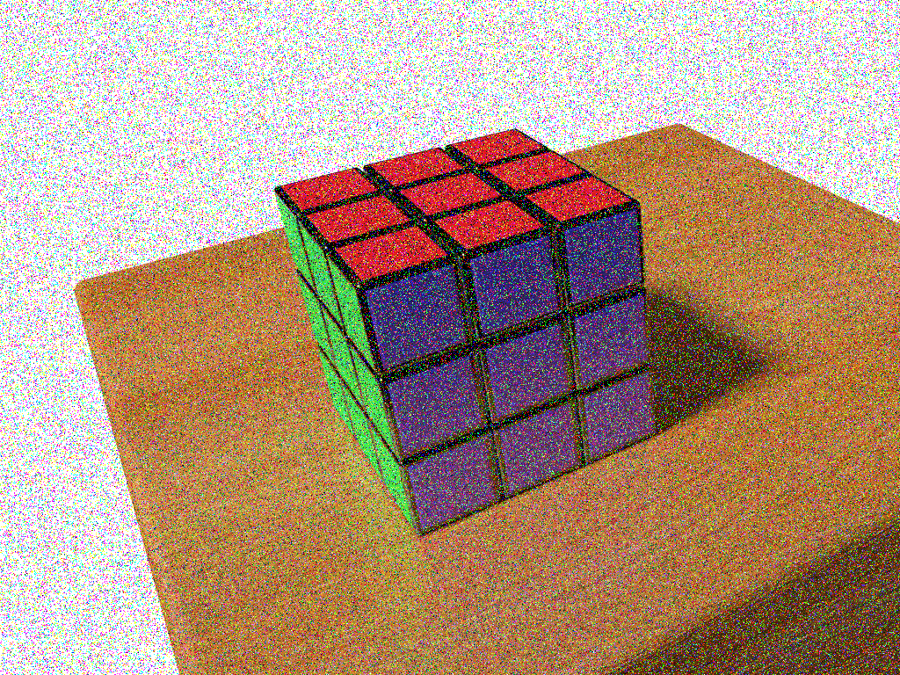
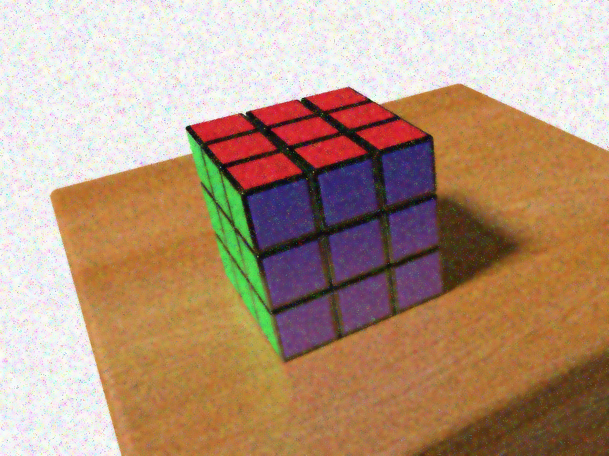

# Compte rendu de TP 2

Composition du groupe : 
- Vincent COMMIN
- Louis LEENART

# Introduction

# Exercice 1 : Suppression d'un bruit impulsionnel

L'objectif de cet exercice est de retiré le bruit impulsionnel de cette image : 

## 1. Filtre moyenneur
|  |  |  |
| ----------------------------- | ----------------------------- | ----------------------------- |
| *image floutée 1 fois*        | *image floutée 2 fois*        | *image floutée 6 fois*        |

Après application du filtre moyenneur plusieurs fois sur l'image, on constate que celle-ci ne tend pas vers une image amélioré. Non-seulement l'image n'est pas bien débruité mais celle-ci devient de plus en plus floue. On perd donc toutes les informations liées au contour.

|  |  |
| ----------------------------- | ----------------------------- |
|   *image floutée 1 fois par un filtre 5x5*                            |  *image floutée 1 fois par un filtre 7x7*                             |

On remarque que même en changeant la taille du filtre, le résultat reste le même, à savoir : flou tout en diluant le bruit dans l'image.

## 2. Filtre gaussien

|  |  |  |
| ----------------------------- | ----------------------------- | ----------------------------- |
| *image avec filtre gaussien 3x3*        | *image avec filtre gaussien 5x5*        | *image avec filtre gaussien 7x7*        |

Le filtre gaussien applique un flou tout en permettant mieux de garder les contours. On constate donc qu'il n'y a pas de grande différences entre les images filtrées avec des filtres de taille différente et l'image de base. Ceci est dû au type de bruit, chaque pixel bruité est considéré comme une bordure et est donc gardé par le filtre. Comparé au filtre moyenneur, les contours sont mieux conservé mais le bruit l'est aussi.

## 3. Filtre bilateral

|  |  |  |
| ----------------------------- | ----------------------------- | ----------------------------- |
| *image avec filtre bilateral appliqué 1 fois*        | *image avec filtre bilateral appliqué 2 fois*        | *image avec filtre bilateral appliqué 3 fois*        |

On constate que le filtre bilatéral retire plus de bruit mais accentue le flou (plus que le filtre moyenneur et gaussien). On remarque que les parties les plus débruités sont la table et le Rubik's cube. Le bruit sur le fond blanc est mélangé avec celui-ci.

Le filtre bilatéral permet de réduire le bruit faible tout en gardant les contours. Etant donné la nature du bruit (poivre et sel) il n'est pas très adéquat.

## 4. Filtre médian

## 5. Histogramme avec masque de l'image bruitée

## 6. Filtre médian #2 

## 7. Plusieurs passes de filtre médian

## 8. Bruit blanc gaussien

